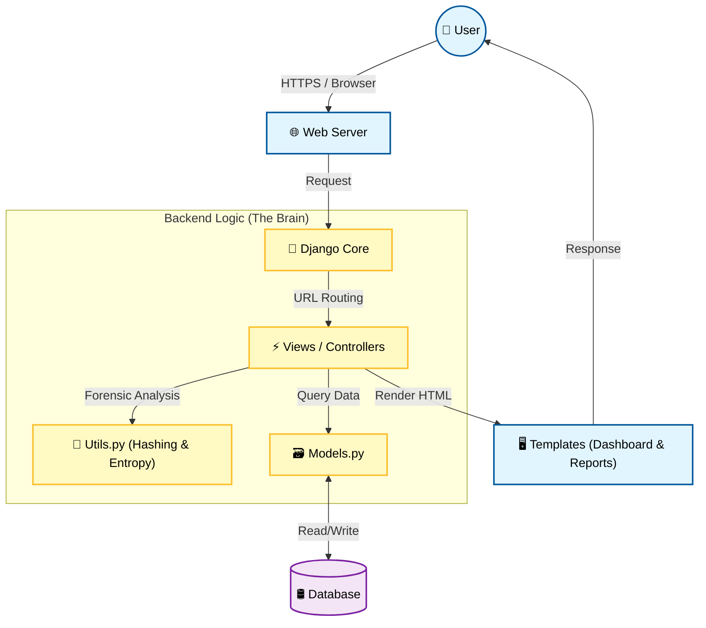
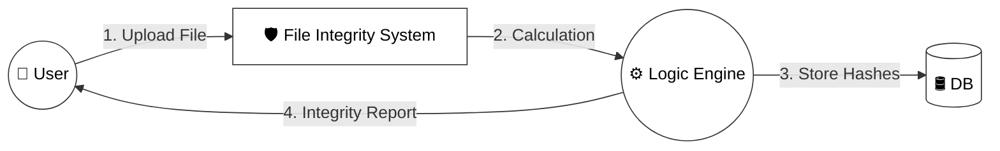
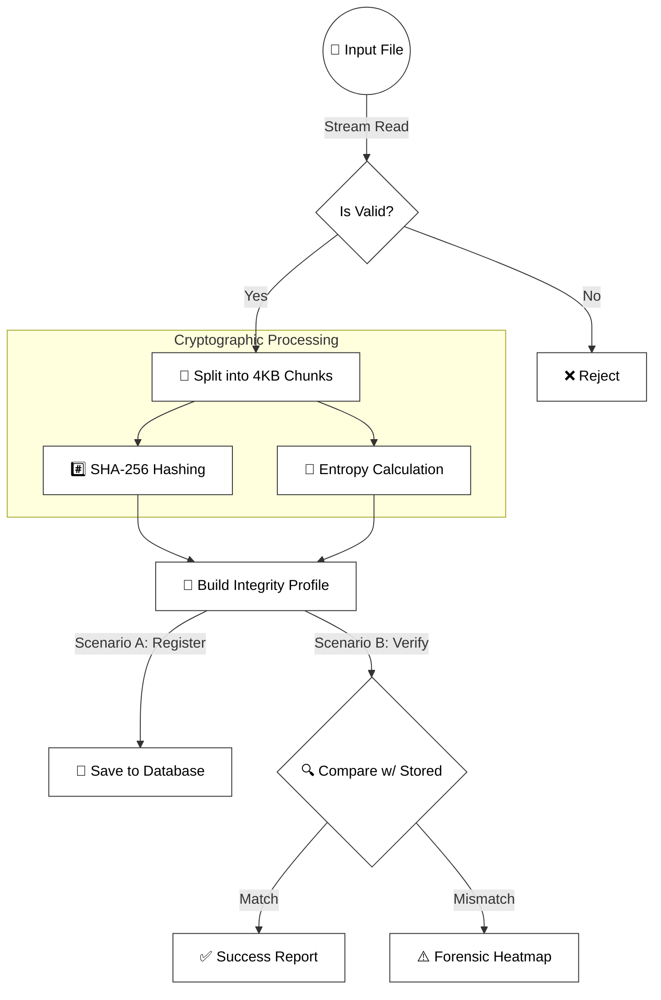
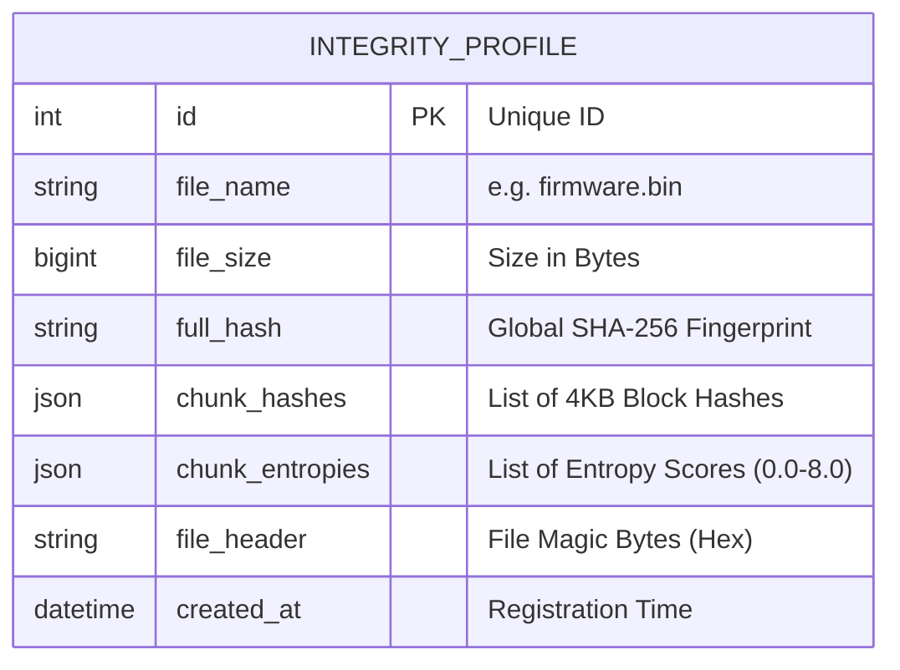
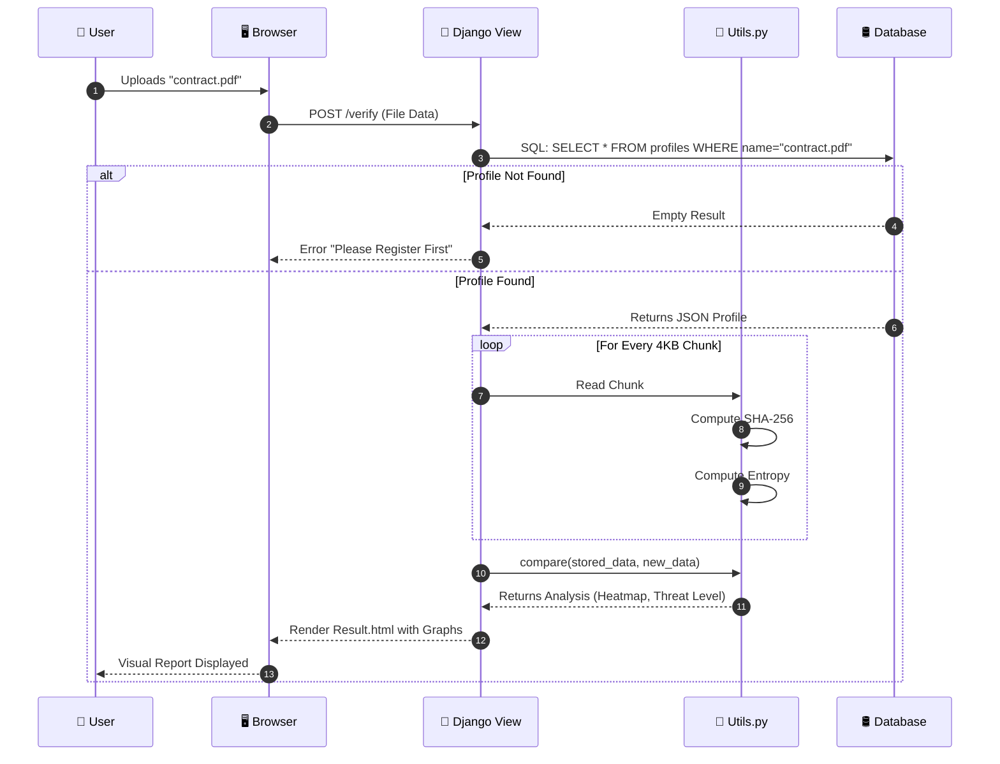
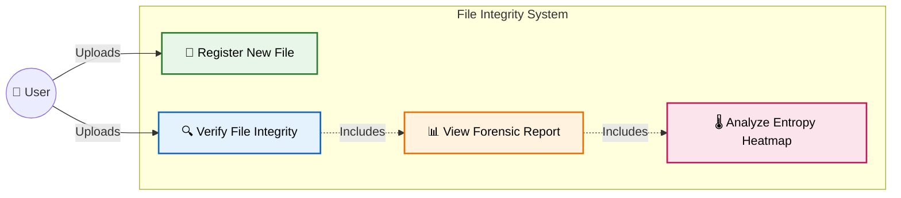
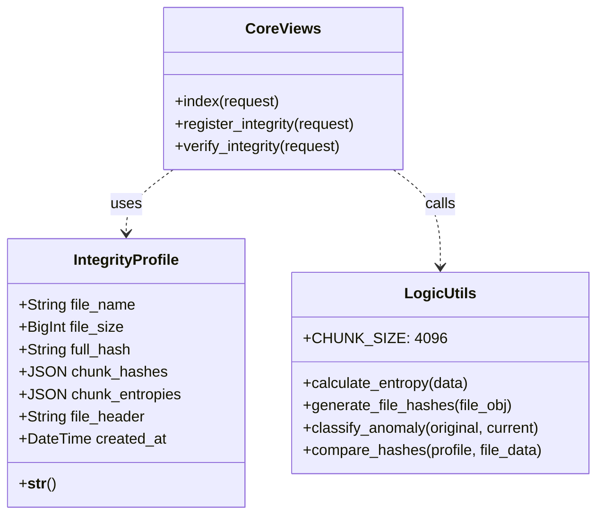
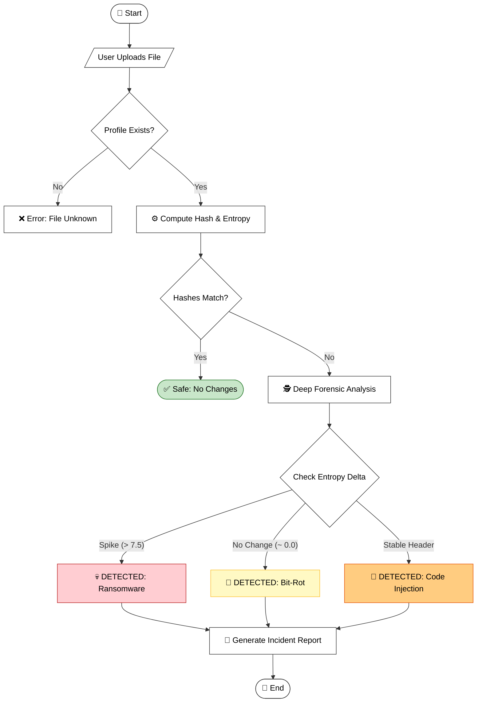

# 🏗️ System Architecture & Design Portfolio

**Project:** Forensic Intelligence (File Integrity Verification System)  
**Document Status:** Final  
**Intended Audience:** Evaluators, Developers, and System Architects

---

## 📖 Executive Summary

This document visualizes the internal architecture of our **Privacy-Preserving File Integrity System**. Unlike traditional tools that just check *if* a file changed, our system understands *how* and *where* it changed using **Cryptographic Forensics** (SHA-256 + Shannon Entropy).

**Key Architectural Decisions:**
1.  **Zero-Knowledge Storage**: We only store mathematical fingerprints, never the actual files.
2.  **Granular Analysis**: Files are processed in 4KB chunks, allowing for "Heatmap" visualization.
3.  **Heuristic Logic**: A decision engine classifies anomalies as Bit-Rot, Ransomware, or Injection.

---

## 1. 🏛️ High-Level System Architecture
**"The 10,000-foot view of how the system works."**

We utilize a **Django MVT (Model-View-Template)** architecture. The system is layered to separate user interaction, business logic, and data storage.

### 🎨 Architecture Diagram

**🗣️ Presentation Talking Points:**
*   "The user interacts with a clean web interface."
*   "The heart of the system is the **Utils.py** module, which acts as the 'Forensic Brain'."
*   "The database stores **IntegrityProfiles**—lightweight metadata fingerprints—keeping user data private."

---

## 2. 🔄 Data Flow Diagrams (DFD)
**"How data moves through the system."**

### Level 0: The Context (The Big Picture)
Simple Input/Output flow.

### Level 1: Detailed Process Flow
What happens inside the "Logic Engine"?

---

## 3. 🗂️ Database Design (ER Diagram)
**"How we structure the data."**

We use a flat, efficient schema optimized for fast lookups.

**🗣️ Presentation Taking Point:** "Notice the `chunk_entropies` JSON field. This is what allows us to later generate the 'Heatmap' and detect if a specific part of the file was encrypted by ransomware."

---

## 4. 📐 UML Diagrams
**"The formal blueprints of the software."**

### A. Sequence Diagram
**"The timeline of a verification request."**

### B. Use Case Diagram
**"Who does what?"**

### C. Class Diagram
**"The code structure."**

### D. Activity Diagram
**"The logic flow for classifying threats."**

