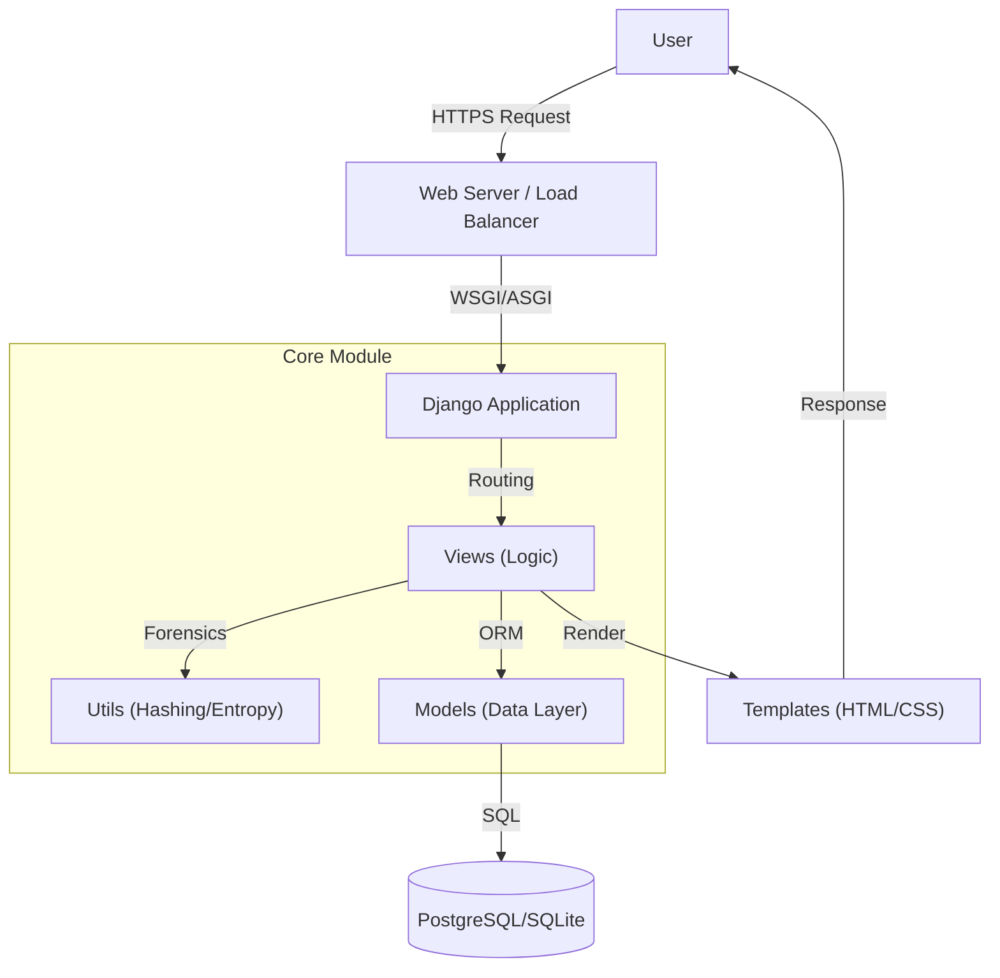
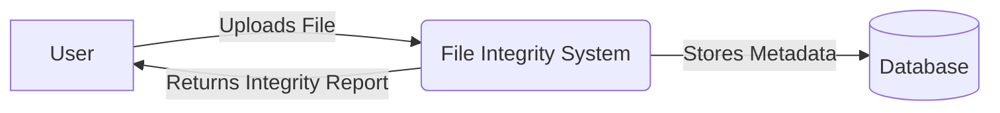
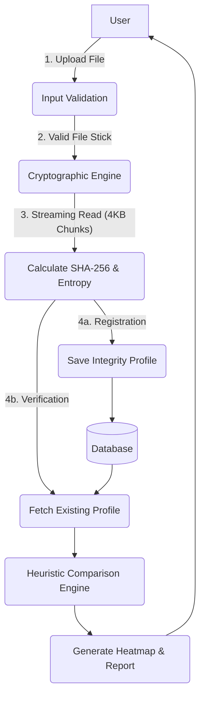
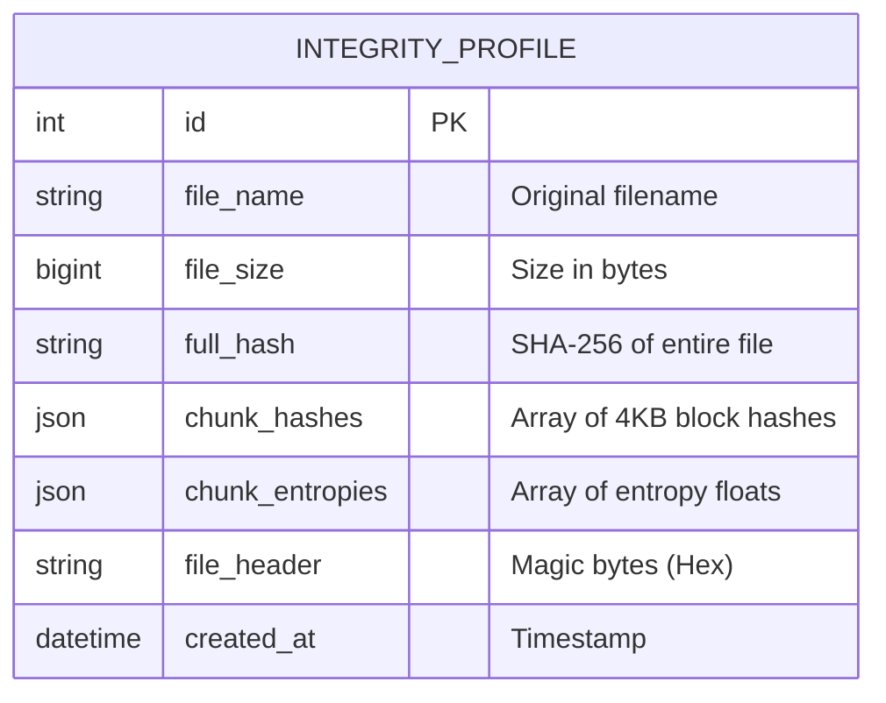
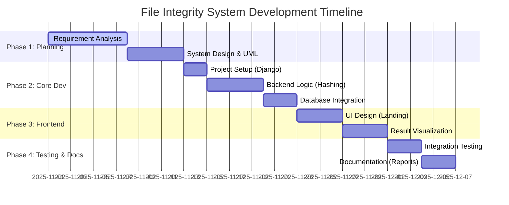
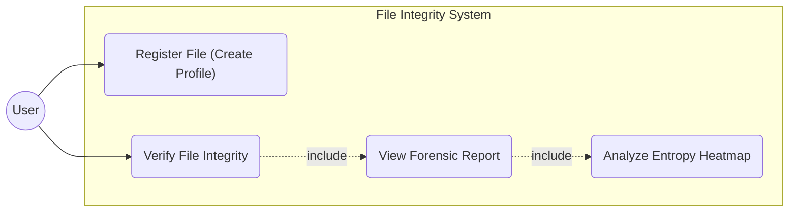
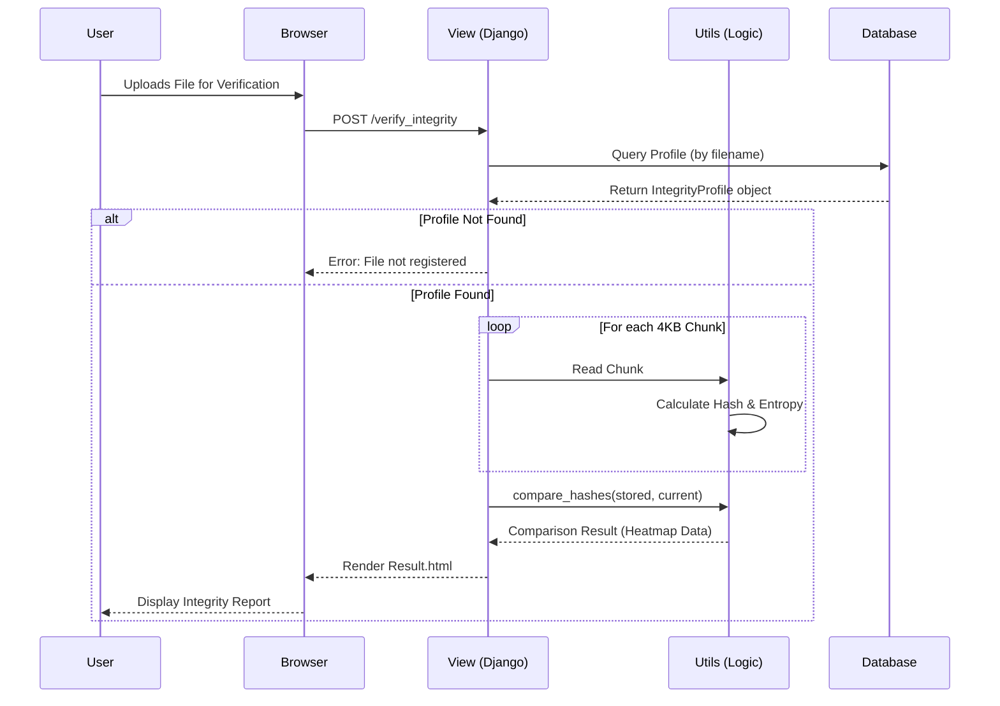
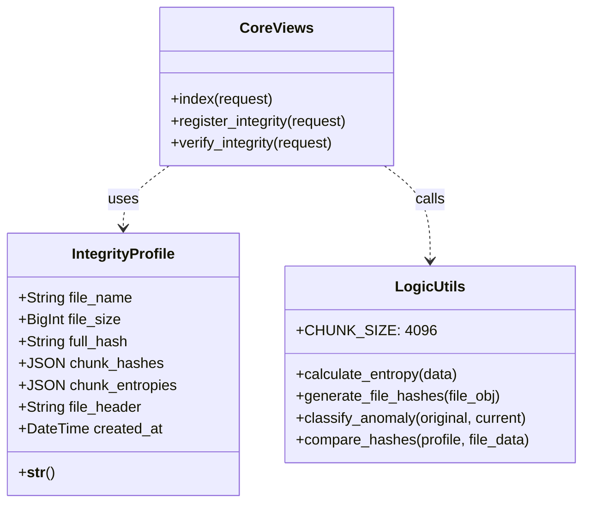
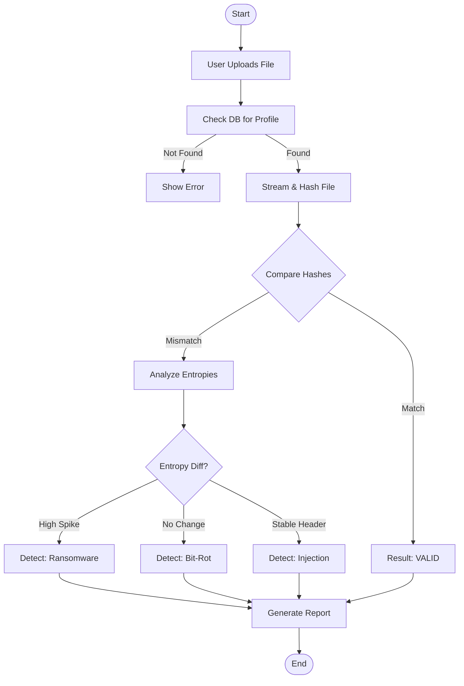

# System Design & Architecture Documentation

This document outlines the architectural blueprints, data flows, and design diagrams for the **Forensic Intelligence (File Integrity System)**. It is designed to be used for project presentations, technical documentation, and system analysis.

## 1. System Design Architecture (High Level)

The system follows the **Django MVT (Model-View-Template)** architecture, which is a variation of the MVC pattern.

*   **Model**: Manages the data schema (`IntegrityProfile`) and database interactions.
*   **View**: Handles business logic, file processing, and cryptographic analysis (`views.py`, `utils.py`).
*   **Template**: Renders the user interface (`landing.html`, `result.html`).

### Component Diagram

---

## 2. Data Flow Diagram (DFD)

### Level 0 (Context Diagram)

### Level 1 (Process Decomposition)

---

## 3. Entity Relationship (ER) Diagram

Since this is a privacy-focused system, we only store **metadata**, not the actual files.

---

## 4. Project Schedule (Gantt Chart)

A typical timeline for the development of this Mini Project.

---

## 5. UML Diagrams

### A. Use Case Diagram
Describes the user's interaction with the system.

*(Note: Modeled using Graph syntax for compatibility)*

### B. Sequence Diagram (Verification Flow)
Detailed flow of messages during a file verification process.

### C. Class Diagram
Represents the code structure and relationships.

### D. Activity Diagram
The logic flow for deciding if a file is safe or corrupted.

